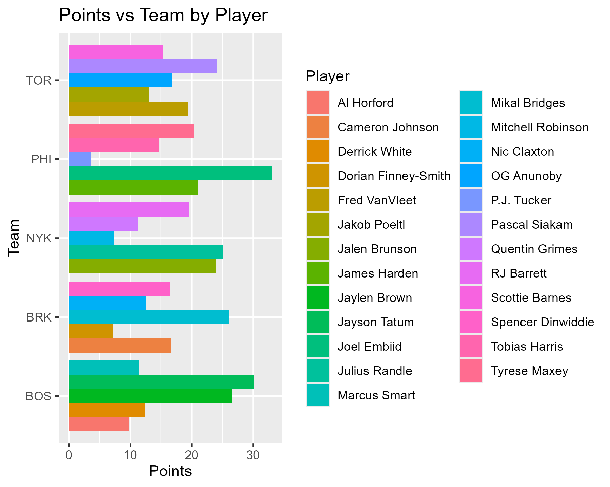
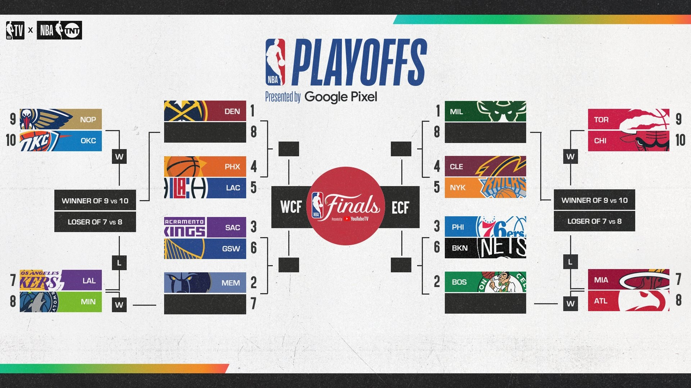

---
title: "NBA - Combination of Inputs"
output: 
  flexdashboard::flex_dashboard:
    orientation: columns
    vertical_layout: fill
    logo: logo.png
    source_code: embed
    social: menu

runtime: shiny
---

```{r global, include=FALSE}
# load data in 'global' chunk so it can be shared by all users of the dashboard
library(flexdashboard)
library(tidyverse)
library(plotly)
library(knitr)
library(DT)
library(lubridate)
df <- read_csv('nba_data_processed.csv')
#df <- drop_na(df, Age)

#df <- drop_na(df, Pos)
df <- df %>% filter(Tm =='BOS' | Tm =='NYK' | Tm =='BRK' | Tm =='PHI' | Tm =='TOR')
df$Tm = factor(df$Tm)
df$Pos = factor(df$Pos)

nba_tm <- unique(df$Tm)
```

{.sidebar}
=======================================================================

The NBA player statistics data set provides detailed performance metrics for various NBA players from the 2022-2023 season. Some key statistics include points, assists, rebounds, and shooting percentages. It also includes information on individual player performance and teams across the country. This data can be used to analyze player performance trends, compare players across teams, and gain insights into team dynamics.

```{r}
sliderInput(inputId = "PTS_input",
            label = h3("Point Range"),
            min = min(df$PTS, na.rm=TRUE),
            max = max(df$PTS, na.rm=TRUE),
            value= c(10, 30))

selectInput(inputId = "Tm_input", 
            label = h3("Team"),
            choices = nba_tm, 
            selected = 'BOS')

checkboxGroupInput(inputId = "Pos_input", 
                   label = h3("Position"),
                   choices = unique(df$Pos), 
                   inline = TRUE,
                   selected = 'C')
```

Main Tab 1
=======================================================================

Column {data-width=500}
-----------------------------------------------------------------------

### Density Plot

```{r}
renderPlotly({
  p1 <- df %>% 
    filter(PTS>input$PTS_input[1], PTS<input$PTS_input[2]) %>% 
    filter(Tm==input$Tm_input) %>% 
    filter(Pos %in% input$Pos_input) %>% 
    ggplot(aes(x=Age, y=FG))+
    geom_point()
  ggplotly(p1)
})
```

Column {data-width=500}
-----------------------------------------------------------------------

### Bar Plot

```{r}
renderPlotly({
  p2 <- df %>% 
    filter(PTS>input$PTS_input[1], PTS<input$PTS_input[2]) %>% 
    filter(Tm==input$Tm_input) %>% 
    filter(Pos %in% input$Pos_input) %>%  
    ggplot(aes(x=Pos, fill=Player))+
    geom_bar()
  ggplotly(p2)
})
```


Main Tab 2
=======================================================================

Column {data-width=500}
-----------------------------------------------------------------------

### Density Plot

```{r}
renderPlotly({
  p1 <- df %>% 
    filter(PTS>input$PTS_input[1], PTS<input$PTS_input[2]) %>% 
    filter(Tm==input$Tm_input) %>% 
    filter(Pos %in% input$Pos_input) %>% 
    ggplot(aes(x=Age, y=PTS, color=Player))+
    geom_point()
  ggplotly(p1)
})
```

Column {data-width=500}
-----------------------------------------------------------------------

### Points vs Team by Player





Main Tab 3
=======================================================================

Column {data-width=500}
-----------------------------------------------------------------------

### Bar Plot

```{r}
renderPlotly({
  p2 <- df %>% 
    filter(PTS>input$PTS_input[1], PTS<input$PTS_input[2]) %>% 
    filter(Tm==input$Tm_input) %>% 
    filter(Pos %in% input$Pos_input) %>%  
    ggplot(aes(x=Pos, fill=Player))+
    geom_bar()
  ggplotly(p2)
})
```

Column {data-width=500}
-----------------------------------------------------------------------

### 2022-2023 




